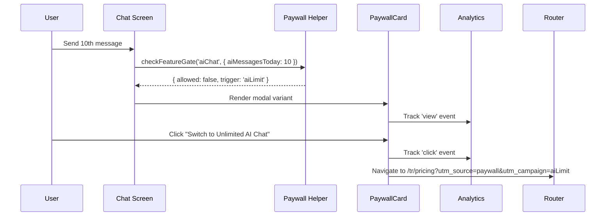
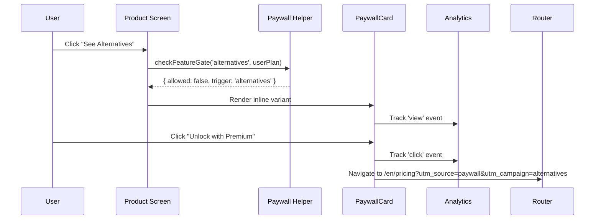
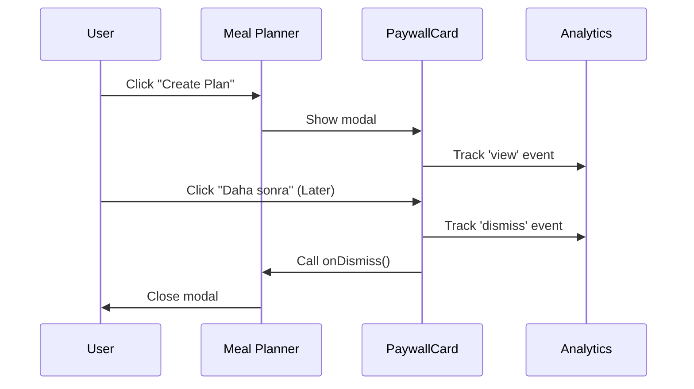

# Analytics Events Schema - Paywall Integration

**Document Version:** 1.0
**Last Updated:** 2025-10-13
**Status:** Production Ready

## Overview

This document defines the analytics event schema for CORIA's paywall trigger system. All upgrade-related user interactions are tracked for conversion optimization and feature analysis.

## Event Types

### 1. Paywall Trigger View

**Event Name:** `paywall_trigger`
**Trigger:** When a paywall card is displayed to the user
**Frequency:** Once per component mount

**Parameters:**
```typescript
{
  trigger_type: 'alternatives' | 'recipes' | 'aiLimit' | 'pantryLimit' | 'mealPlanner',
  source_component: string,      // Component/screen name
  user_action: 'view',
  timestamp: number,              // Unix timestamp (ms)
  variant: 'inline' | 'modal',    // UI variant
  pathname: string                // Current page path
}
```

**Example:**
```javascript
gtag('event', 'paywall_trigger', {
  trigger_type: 'aiLimit',
  source_component: 'chat-screen',
  user_action: 'view',
  timestamp: 1697203200000,
  variant: 'modal',
  pathname: '/tr/dashboard'
});
```

### 2. Upgrade Button Click

**Event Name:** `paywall_trigger`
**Trigger:** When user clicks upgrade CTA button
**Frequency:** Once per button click

**Parameters:**
```typescript
{
  trigger_type: 'alternatives' | 'recipes' | 'aiLimit' | 'pantryLimit' | 'mealPlanner',
  source_component: string,
  user_action: 'click',
  timestamp: number,
  url: string,                    // Pricing page URL with UTM params
  locale: string                  // User locale (en, tr, de, fr)
}
```

**Example:**
```javascript
gtag('event', 'paywall_trigger', {
  trigger_type: 'pantryLimit',
  source_component: 'pantry-screen',
  user_action: 'click',
  timestamp: 1697203250000,
  url: '/tr/pricing?utm_source=paywall&utm_medium=upgrade&utm_campaign=pantryLimit&src=pantryLimit',
  locale: 'tr'
});
```

### 3. Paywall Dismissal

**Event Name:** `paywall_trigger`
**Trigger:** When user dismisses modal paywall (modal variant only)
**Frequency:** Once per dismissal

**Parameters:**
```typescript
{
  trigger_type: 'alternatives' | 'recipes' | 'aiLimit' | 'pantryLimit' | 'mealPlanner',
  source_component: string,
  user_action: 'dismiss',
  timestamp: number
}
```

**Example:**
```javascript
gtag('event', 'paywall_trigger', {
  trigger_type: 'recipes',
  source_component: 'recipe-discovery',
  user_action: 'dismiss',
  timestamp: 1697203300000
});
```

## Trigger Types

| Trigger | Feature | Free Plan Limit | Premium Access |
|---------|---------|-----------------|----------------|
| `alternatives` | Product alternatives | ❌ Not available | ✅ Unlimited |
| `recipes` | Recipe suggestions | ❌ Not available | ✅ Unlimited |
| `aiLimit` | AI chat assistant | 10 messages/day | ✅ Unlimited |
| `pantryLimit` | Smart pantry | 20 items max | ✅ Unlimited + automation |
| `mealPlanner` | Meal planner | ❌ Not available | ✅ Unlimited |

## UTM Parameters

All upgrade navigation includes consistent UTM tracking:

```
utm_source=paywall
utm_medium=upgrade
utm_campaign={triggerType}
src={triggerType}
```

**Example URLs:**
```
/en/pricing?utm_source=paywall&utm_medium=upgrade&utm_campaign=alternatives&src=alternatives
/tr/pricing?utm_source=paywall&utm_medium=upgrade&utm_campaign=aiLimit&src=aiLimit
/de/pricing?utm_source=paywall&utm_medium=upgrade&utm_campaign=pantryLimit&src=pantryLimit
```

## Analytics Integration Points

### Google Analytics 4

**Implementation:** Via `window.gtag()` function
**File:** `src/lib/paywall.ts` → `trackPaywallEvent()`

```typescript
if (window.gtag) {
  window.gtag('event', 'paywall_trigger', {
    trigger_type: event.trigger,
    source_component: event.source,
    user_action: event.userAction || 'view',
    timestamp: event.timestamp,
    ...event.metadata,
  });
}
```

### Custom Analytics API

**Endpoint:** `POST /api/analytics/paywall`
**Implementation:** Optional fetch request for internal tracking
**File:** `src/lib/paywall.ts` → `trackPaywallEvent()`

**Request Body:**
```typescript
{
  trigger: 'aiLimit',
  source: 'chat-screen',
  timestamp: 1697203200000,
  userAction: 'click',
  metadata: {
    url: '/tr/pricing?utm_source=paywall...',
    locale: 'tr'
  }
}
```

**Response:** 204 No Content (fire-and-forget)

## Event Flow Examples

### Example 1: AI Chat Limit Reached



### Example 2: Alternative Product Request



### Example 3: Modal Dismissal



## Conversion Funnel

**Tracking Path:**
```
1. Feature Limit Hit → checkFeatureGate() returns { allowed: false }
2. Paywall View → Track 'view' event
3. User Action → Track 'click' or 'dismiss' event
4. Pricing Page → Track page_view with UTM params
5. Upgrade Complete → Track conversion event (handled separately)
```

## Metrics to Monitor

### Conversion Metrics
- **Paywall View Rate:** (Paywall views / Total feature attempts) × 100
- **Click-Through Rate:** (CTA clicks / Paywall views) × 100
- **Conversion Rate:** (Upgrades / CTA clicks) × 100

### Feature-Specific Metrics
- **Top Trigger:** Which trigger generates most upgrades
- **Source Analysis:** Which screens/components drive most conversions
- **Dismissal Rate:** (Dismissals / Modal views) × 100

### Cohort Analysis
- Conversion by locale (en/tr/de/fr)
- Time-to-conversion by trigger type
- Repeat paywall views before upgrade

## Implementation Checklist

### ✅ Completed
- [x] Paywall helper module (`src/lib/paywall.ts`)
- [x] PaywallCard component integration
- [x] Google Analytics 4 integration
- [x] UTM parameter generation
- [x] View/Click/Dismiss event tracking
- [x] Multi-locale support

### 🔄 In Progress
- [ ] Custom analytics API endpoint
- [ ] Server-side event processing
- [ ] Analytics dashboard

### 📋 Future Enhancements
- [ ] A/B testing framework for paywall messaging
- [ ] Personalized trigger timing based on user behavior
- [ ] Exit-intent modal triggers
- [ ] Email follow-up for dismissed paywalls

## Testing

### Development Mode
All paywall events are logged to console in development:

```javascript
if (process.env.NODE_ENV === 'development') {
  console.log('[Paywall Event]', {
    trigger: 'aiLimit',
    source: 'chat-screen',
    timestamp: Date.now(),
    userAction: 'view'
  });
}
```

### Manual Testing
```typescript
// Test upgrade navigation
import { navigateToUpgrade } from '@/lib/paywall';
navigateToUpgrade('alternatives', 'en', router);

// Test feature gating
import { checkFeatureGate } from '@/lib/paywall';
const result = checkFeatureGate('recipes', { type: 'free', isActive: true });
// Returns: { allowed: false, trigger: 'recipes', reason: '...' }

// Test usage tracking
import { usageTracker } from '@/lib/paywall';
const count = usageTracker.incrementAiMessages();
// Returns: 1, 2, 3, ..., 10
```

### E2E Testing
Test scenarios included in `e2e/tests/pricing-upgrade.spec.ts`:
- Paywall card rendering with correct messaging
- UTM parameter presence in upgrade URLs
- Analytics event firing on interactions

## Troubleshooting

### Issue: Events not appearing in GA4
**Solution:** Check that `window.gtag` is defined and GA4 is initialized

### Issue: UTM parameters missing
**Solution:** Verify `navigateToUpgrade()` is used instead of direct routing

### Issue: Usage limits not enforced
**Solution:** Check `checkFeatureGate()` is called before feature access

## Security & Privacy

- ✅ No PII (personally identifiable information) in event data
- ✅ User IDs anonymized in analytics
- ✅ GDPR-compliant tracking (consent required)
- ✅ LocalStorage usage for client-side limit tracking only

## Support & Maintenance

**Primary Contact:** Engineering Team
**Documentation:** `docs/analytics-events-schema.md`
**Implementation:** `src/lib/paywall.ts`, `src/components/pricing/paywall-card.tsx`
**Analytics Dashboard:** [Google Analytics 4 Dashboard URL]

---

**Document Status:** ✅ Production Ready
**Next Review:** 2025-11-13 (monthly review cycle)
