# CORIA Translation QA Workflow

**Purpose**: Comprehensive quality assurance process for translation integration
**Last Updated**: October 3, 2025
**Version**: 1.0

---

## 🎯 Overview

This document defines the complete QA workflow for validating German (DE) and French (FR) translations before integration into production. The workflow combines automated validation scripts with manual QA checkpoints.

### Quality Gates

| Gate | Type | Blocker | Tools |
|------|------|---------|-------|
| **1. Structure Validation** | Automated | ✅ Yes | `validate-translations.js` |
| **2. Completeness Check** | Automated | ✅ Yes | `validate-translations.js` |
| **3. Encoding Validation** | Automated | ✅ Yes | `validate-translations.js` |
| **4. Length Validation** | Automated | ⚠️ Warning | `validate-translations.js` |
| **5. Manual QA Sampling** | Manual | 🟡 Conditional | QA Checklist |
| **6. UI Integration Test** | Manual | ✅ Yes | Test Plan |
| **7. Native Speaker Review** | Manual | 🟡 Conditional | Review Checklist |

---

## 📋 Automated Validation

### 1. Structure Validation

**Purpose**: Ensure JSON structure is valid and matches baseline

**Checks**:
- ✅ Valid JSON syntax (no parse errors)
- ✅ Nested structure matches Turkish baseline
- ✅ No extra keys present
- ✅ Key paths match exactly (e.g., `features.barcodeScan.title`)

**Command**:
```bash
npm run i18n:validate
# or
node scripts/validate-translations.js --locale=de --strict
```

**Expected Output**:
```
✅ DE: JSON structure valid
✅ DE: All 589 keys present (100% coverage)
✅ DE: No extra keys found
✅ DE: Structure matches baseline
```

**Failure Handling**:
```bash
# If validation fails:
❌ DE: Invalid JSON syntax at line 45
   Fix: Review JSON file for syntax errors (missing commas, quotes)

❌ DE: Missing keys: features.aiRecommendations.title (15 total)
   Fix: Add missing translations before proceeding

❌ DE: Extra keys found: obsolete.oldKey (3 total)
   Fix: Remove keys not present in baseline
```

---

### 2. Completeness Check

**Purpose**: Verify 100% translation coverage

**Checks**:
- ✅ All 589 baseline keys translated
- ✅ No empty strings or placeholder values
- ✅ No untranslated keys (still in Turkish/English)

**Command**:
```bash
node scripts/validate-translations.js --locale=de --check-empty
```

**Expected Output**:
```
✅ DE: 589/589 keys translated (100%)
✅ DE: No empty values found
✅ DE: No placeholder text detected
```

**Failure Handling**:
```bash
❌ DE: Empty values found (5 keys)
   - features.smartPantry.description: ""
   - pricing.plans.free.cta: ""
   Fix: Complete all empty translations

❌ DE: Placeholder text detected (2 keys)
   - blog.readMore: "[TRANSLATE]"
   Fix: Replace placeholder text with actual translations
```

---

### 3. Encoding Validation

**Purpose**: Ensure proper UTF-8 encoding and special character rendering

**Checks**:
- ✅ File is UTF-8 encoded (no BOM)
- ✅ Special characters present (DE: ä, ö, ü, ß / FR: é, è, ê, à, ç)
- ✅ No character encoding errors
- ✅ No escaped unicode sequences where unnecessary

**Command**:
```bash
node scripts/validate-translations.js --locale=de --check-encoding
```

**Expected Output**:
```
✅ DE: UTF-8 encoding verified
✅ DE: Special characters detected (57 instances)
✅ DE: No encoding errors found
```

**Failure Handling**:
```bash
⚠️ DE: No special characters found
   Warning: German text should contain ä, ö, ü, ß
   Action: Review translation quality

❌ FR: Encoding errors detected
   - Line 45: Invalid UTF-8 sequence
   Fix: Re-save file with UTF-8 encoding (no BOM)
```

---

### 4. Length Validation

**Purpose**: Prevent UI breaks from overly long translations

**Checks**:
- ⚠️ Warning if translation >150% of Turkish length
- ⚠️ Warning for critical UI elements (buttons, nav)
- ✅ Statistics on length variance

**Command**:
```bash
node scripts/validate-translations.js --locale=de --check-length
```

**Expected Output**:
```
ℹ️ DE: Average length: 112% of baseline
✅ DE: Critical elements within limits
⚠️ DE: 12 keys exceed 150% length threshold
   - features.barcodeScan.description: 187% (review recommended)
   - pricing.plans.premium.features: 165% (review recommended)
```

**Action**:
- Review flagged translations
- Test in UI (especially mobile)
- Request shorter alternatives if needed

---

## 🧪 Manual QA Sampling

### 5. Random Sample Review

**Purpose**: Validate translation quality through statistical sampling

**Sample Size**:
- **< 100 keys**: Review 20% (minimum 10 keys)
- **100-500 keys**: Review 10% (minimum 20 keys)
- **> 500 keys**: Review 5% (minimum 50 keys)

**For CORIA (589 keys)**: Review **50 random keys** (8.5%)

**Selection Method**:
```bash
# Generate random sample
node scripts/validate-translations.js --locale=de --sample=50
```

**Output**: `reports/qa-sample-de-YYYY-MM-DD.json`

**Review Checklist** (for each sampled key):

| Criteria | Pass | Fail | Notes |
|----------|------|------|-------|
| ✅ Meaning preserved from Turkish | ☐ | ☐ | |
| ✅ Grammatically correct | ☐ | ☐ | |
| ✅ Natural phrasing (not machine translation) | ☐ | ☐ | |
| ✅ Consistent with existing translations | ☐ | ☐ | |
| ✅ Appropriate tone (friendly, professional) | ☐ | ☐ | |
| ✅ Technical terms used correctly | ☐ | ☐ | |
| ✅ Sie/vous usage consistent (formal) | ☐ | ☐ | |

**Acceptance Threshold**: **≥ 95% pass rate** (max 2-3 failures in 50 samples)

**Failure Action**:
- < 95% pass: Flag for full review by native speaker
- 80-95% pass: Request corrections for failed items
- < 80% pass: Consider re-translation

---

## 🖥️ UI Integration Testing

### 6. Visual Integration Test

**Purpose**: Ensure translations render correctly in actual UI

**Test Environment**:
```bash
# Start local development server
npm run dev

# Set locale to German
http://localhost:3000/de

# Set locale to French
http://localhost:3000/fr
```

**Test Plan**:

#### Navigation & Header
- [ ] Logo and brand name display correctly
- [ ] Navigation menu items render without truncation
- [ ] Language switcher shows correct locale
- [ ] Theme toggle accessible and labeled
- [ ] Mobile menu works correctly

#### Homepage Hero
- [ ] Hero title displays correctly (no line breaks mid-word)
- [ ] Subtitle readable and properly formatted
- [ ] CTA buttons fit within boundaries
- [ ] Badge text visible and centered

#### Features Page
- [ ] Feature cards display without overflow
- [ ] Descriptions readable (not truncated)
- [ ] Icons aligned with text
- [ ] Feature category navigation works
- [ ] Meta tags correct (view source)

#### Pricing Page
- [ ] Plan names and prices visible
- [ ] Feature lists display completely
- [ ] CTA buttons labeled correctly
- [ ] Currency symbols render (€ for DE/FR)
- [ ] Comparison table readable

#### Blog Section
- [ ] Blog post titles display correctly
- [ ] Category labels fit in tags
- [ ] Read more buttons labeled
- [ ] Date formatting locale-appropriate

#### Footer
- [ ] All footer links translated
- [ ] Copyright notice correct
- [ ] Social media links labeled
- [ ] Newsletter signup form translated

#### Forms & Validation
- [ ] Contact form labels translated
- [ ] Validation errors show in target language
- [ ] Placeholder text appropriate
- [ ] Submit button labeled correctly

**Responsive Testing**:
- [ ] Mobile (375px width)
- [ ] Tablet (768px width)
- [ ] Desktop (1280px width)

**Browser Testing**:
- [ ] Chrome/Edge
- [ ] Firefox
- [ ] Safari (if available)

**Acceptance Criteria**:
- ✅ All text renders without truncation
- ✅ No layout breaks or overflows
- ✅ All interactive elements accessible
- ✅ No mixed languages on same page

---

## 👥 Native Speaker Review

### 7. Professional Quality Review

**Purpose**: Final validation by native speaker for quality assurance

**Reviewer Qualifications**:
- Native speaker of target language
- Professional translation experience (preferred)
- Familiarity with UI/UX terminology
- Understanding of sustainability/vegan terminology

**Review Scope**:
- **Full Review**: All critical paths (navigation, hero, features, pricing)
- **Sample Review**: 10% of remaining keys (randomly selected)

**Review Checklist**:

#### Language Quality
- [ ] Grammar and syntax correct
- [ ] Natural, idiomatic expressions
- [ ] No awkward phrasings
- [ ] Consistent terminology usage
- [ ] Appropriate formality level (Sie/vous)

#### Cultural Appropriateness
- [ ] No cultural insensitivities
- [ ] Idioms adapted (not literal translation)
- [ ] Examples relevant to target market
- [ ] Measurements in local units (if applicable)

#### Brand Voice
- [ ] Friendly and approachable tone maintained
- [ ] Empowering language (not preachy)
- [ ] Consistent with existing brand voice
- [ ] Technical accuracy maintained

#### Terminology Consistency
- [ ] "CORIA" used consistently (brand name)
- [ ] "AI" vs "KI/IA" - check existing usage
- [ ] "Premium" vs "Premium" - standardize
- [ ] "Scanner" vs "Scanngerät/Scanneur" - verify

**Review Process**:
1. Reviewer receives:
   - Translation files (de.json or fr.json)
   - Turkish source (tr.json) for reference
   - Context: Live website in target language
   - Review checklist
2. Reviewer provides:
   - Annotated corrections (JSON or spreadsheet)
   - Quality score (1-5 scale)
   - Priority flags (P1=critical, P2=recommended)
3. Development team:
   - Integrates P1 corrections
   - Reviews P2 suggestions
   - Re-validates with automated tools

**Acceptance Criteria**:
- Quality score: **≥ 4.0 / 5.0**
- Critical issues (P1): **0 remaining**
- Recommended fixes (P2): **< 10% of total keys**

---

## 🔄 Workflow Execution

### Complete QA Process

```mermaid
graph TD
    A[Receive Translation Files] --> B[Automated Validation]
    B --> C{Structure Valid?}
    C -->|No| D[Return to Translator]
    C -->|Yes| E{100% Complete?}
    E -->|No| D
    E -->|Yes| F{Encoding OK?}
    F -->|No| D
    F -->|Yes| G[Manual QA Sampling]
    G --> H{>95% Pass?}
    H -->|No| D
    H -->|Yes| I[UI Integration Test]
    I --> J{UI Renders OK?}
    J -->|No| D
    J -->|Yes| K[Native Speaker Review]
    K --> L{Score ≥4.0?}
    L -->|No| D
    L -->|Yes| M[Approve for Production]
```



### Step-by-Step Execution

**Step 1: Receive Translation Files**
```bash
# Translator delivers: de.json or fr.json
# Save to: src/messages/de.json (or fr.json)
```

**Step 2: Run Automated Validation**
```bash
npm run i18n:validate

# Expected runtime: 2-5 seconds
# Pass criteria: All automated checks ✅
```

**Step 3: Generate QA Sample**
```bash
node scripts/validate-translations.js --locale=de --sample=50

# Output: reports/qa-sample-de-YYYY-MM-DD.json
# Review sample against checklist
```

**Step 4: UI Integration Test**
```bash
npm run dev
# Open http://localhost:3000/de
# Follow UI Test Plan (above)
# Document any issues
```

**Step 5: Native Speaker Review** (if budget allows)
```bash
# Send to reviewer:
# - src/messages/de.json
# - Translation_QA_Workflow.md (this file)
# - Review checklist

# Wait for review (1-2 business days)
# Integrate corrections
```

**Step 6: Final Validation**
```bash
# After any corrections, re-run:
npm run i18n:validate

# Confirm all checks pass
```

**Step 7: Production Deployment**
```bash
# Create PR with translation updates
git checkout -b translation/de-fr-completion
git add src/messages/de.json src/messages/fr.json
git commit -m "feat(i18n): Complete German and French translations (589 keys)"
git push origin translation/de-fr-completion

# Create PR and request review
```

---

## 📊 Quality Metrics

### Target Metrics

| Metric | Target | Measurement |
|--------|--------|-------------|
| **Translation Coverage** | 100% | Automated validation |
| **Structure Accuracy** | 100% | Automated validation |
| **Encoding Correctness** | 100% | Automated validation |
| **QA Sample Pass Rate** | ≥ 95% | Manual review |
| **UI Integration Pass Rate** | 100% | Manual testing |
| **Native Speaker Score** | ≥ 4.0/5.0 | Professional review |
| **Zero Critical Issues** | 0 P1 bugs | Combined validation |

### Reporting

After completing QA, generate final report:

```bash
node scripts/validate-translations.js --locale=de --report

# Generates: reports/translation-qa-report-de-YYYY-MM-DD.md
```

**Report Contents**:
- ✅ All validation results (pass/fail)
- 📊 Quality metrics achieved
- ⚠️ Warnings and recommendations
- 📝 Issues found and resolutions
- ✍️ Native speaker feedback summary
- 🎯 Production readiness assessment

---

## 🚨 Common Issues & Solutions

### Issue 1: JSON Syntax Errors

**Symptoms**:
```
❌ DE: JSON parse error at line 234
```

**Solution**:
1. Open de.json in VS Code
2. Enable JSON validation (built-in)
3. Fix syntax errors (missing commas, quotes)
4. Re-run validation

**Prevention**:
- Use JSON validator before delivery
- Test with `node -c scripts/validate-translations.js`

---

### Issue 2: Missing Keys

**Symptoms**:
```
❌ DE: Missing keys: features.aiRecommendations.title (15 total)
```

**Solution**:
1. Run extraction script to identify missing keys:
   ```bash
   node scripts/extract-missing-translations.js --locale=de
   ```
2. Review reports/missing-translations-de.json
3. Request additional translations for missing keys
4. Integrate and re-validate

**Prevention**:
- Provide complete key list to translator upfront
- Use Translation_Task_DE.md as official brief

---

### Issue 3: UI Overflow/Truncation

**Symptoms**:
- Text cut off on buttons
- Navigation items wrap to multiple lines
- Cards display scrollbars

**Solution**:
1. Identify specific keys causing issues
2. Request shorter alternatives from translator
3. Adjust UI if translation is accurate but lengthy
4. Test across all breakpoints

**Prevention**:
- Include length guidelines in translator brief
- Specify critical UI elements (buttons, nav)

---

### Issue 4: Encoding Problems

**Symptoms**:
- Special characters show as �
- ä, ö, ü render incorrectly

**Solution**:
1. Re-save file as UTF-8 (no BOM) in VS Code
2. Verify in browser developer tools (Network tab)
3. Check HTTP headers: `Content-Type: application/json; charset=utf-8`

**Prevention**:
- Specify UTF-8 encoding in translator brief
- Validate encoding in automated checks

---

### Issue 5: Inconsistent Terminology

**Symptoms**:
- "AI" used in some places, "KI" in others (German)
- "Premium" vs "Prämie" inconsistency

**Solution**:
1. Create terminology glossary:
   ```json
   {
     "AI": "AI (keep as-is)",
     "Premium": "Premium (keep as-is)",
     "Scanner": "Scanner (not Scangerät)"
   }
   ```
2. Run find/replace for inconsistencies
3. Share glossary with translator for future work

**Prevention**:
- Include terminology glossary in Translation_Task brief
- Provide examples of existing translations

---

## 📞 Support & Questions

**For Translators**:
- Technical issues: development@coria.app
- Context questions: Review live site at coria.app/de
- Terminology: Check existing translations in src/messages/de.json

**For QA Team**:
- Validation script issues: Check scripts/validate-translations.js
- UI integration issues: Test with `npm run dev`
- Native speaker coordination: Project manager

**For Developers**:
- Integration: Follow Translation_Implementation_Guide.md
- Deployment: Create PR with translation updates
- Monitoring: Track translation coverage in CI/CD

---

## ✅ Final Checklist

Before approving translations for production:

- [ ] Automated validation: All checks pass ✅
- [ ] Completeness: 100% coverage (589/589 keys)
- [ ] Encoding: UTF-8 verified, special characters correct
- [ ] QA sampling: ≥95% pass rate (50 keys reviewed)
- [ ] UI integration: All pages render correctly (mobile + desktop)
- [ ] Browser testing: Chrome, Firefox, Safari tested
- [ ] Length validation: No truncation or overflow
- [ ] Native speaker review: Score ≥4.0/5.0 (if applicable)
- [ ] Critical issues: 0 P1 bugs remaining
- [ ] Documentation: QA report generated
- [ ] Git: PR created with translations
- [ ] CI/CD: All tests passing

**Final Approval**: _________________ (QA Lead)

**Date**: _________________

---

**Version History**:
- v1.0 (2025-10-03): Initial QA workflow documentation
